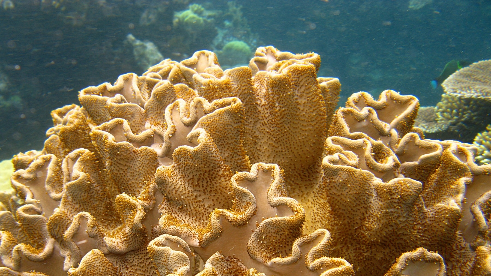

# GeometryLab @ UVA - Spring 2023 

Welcome to the Spring 2023 edition of GeometryLab @ UVA. 

# Groups

## Crochet

Mentors: [Valentina Zapata Castro](https://math.virginia.edu/people/vz6an/)

## 3D printing

Mentors:

- [David Chasteen-Boyd](https://math.virginia.edu/people/kxk2dr/)
- [Alec Traaseth](https://sites.google.com/view/alec-traaseth/?pli=1)

Participants:
- Marco Baessler
- Jacob Bodenhofer
- Seongeun Chung
- Clara Grimmelbein
- Nadara Hudson
- John Layne
- Sam Lichtman
- Charlie Wang
- Alice Wanner

## [Computer visualization](https://github.com/geolab-UVA/Computer-Visualization-SP2023)

Many 3d rendering engines for games and animation are focused on our usual Euclidean reality. Can one use the tools available to help visualize non Euclidean geometries. We are out to understand how visualization and rendering works and how we can adapt it to more exciting and exotic settings. 

Mentor: [Gennady Uraltsev](https://guraltsev.github.io/)

Participants:

- Lincoln Curtis
- Diego Dimattina
- Michelle Giulajan
- Yejun Kim
- Liran Li
- Katherine Moore
- Mandy Unterhalter
- Zerui Wang

Meeting time: Fri 5:30pm-7pm

